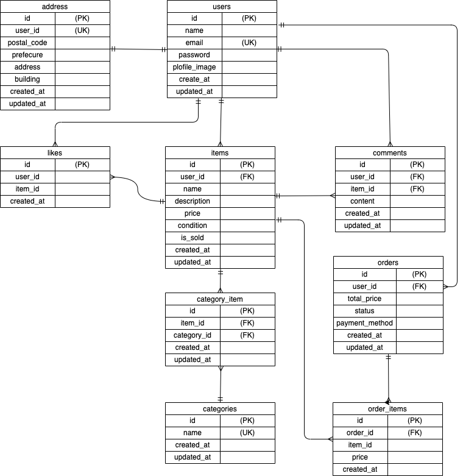

# フリマアプリ（coachtech 模擬案件）

Laravelを使用したフリマアプリです。
ユーザー登録、商品出品、購入、いいね、コメント、カテゴリー分類などの基本機能を実装しています。

# アプリケーション概要

本アプリは、ユーザーが商品を出品・購入できるフリマアプリです。
出品された商品に対して「いいね」や「コメント」が可能で、
商品は複数カテゴリに紐づけて管理できます。

## 環境構築

Dockerビルド

・git clone<git@github.com:yuichihomma/coachtech-flea-app.git>
・cd flea-app
・docker-compose up -d --build

Laravel環境構築

・docker-compose exec php bash
・composer install
・cp .env.example .env
・php artisan key:generate
・php artisan migrate
・php artisan db:seed

##　使用技術

・PHP 8.x
・Laravel 8.x
・MySQL 8.x
・Nginx
・Docker / Docker Compose
・JavaScript
・CSS

##　ER図

## 開発環境URL

・トップページ：http://localhost/
・会員登録：http://localhost/register
・ログイン:http://localhost/login
・phpMyAdmin:http://localhost:8081/
