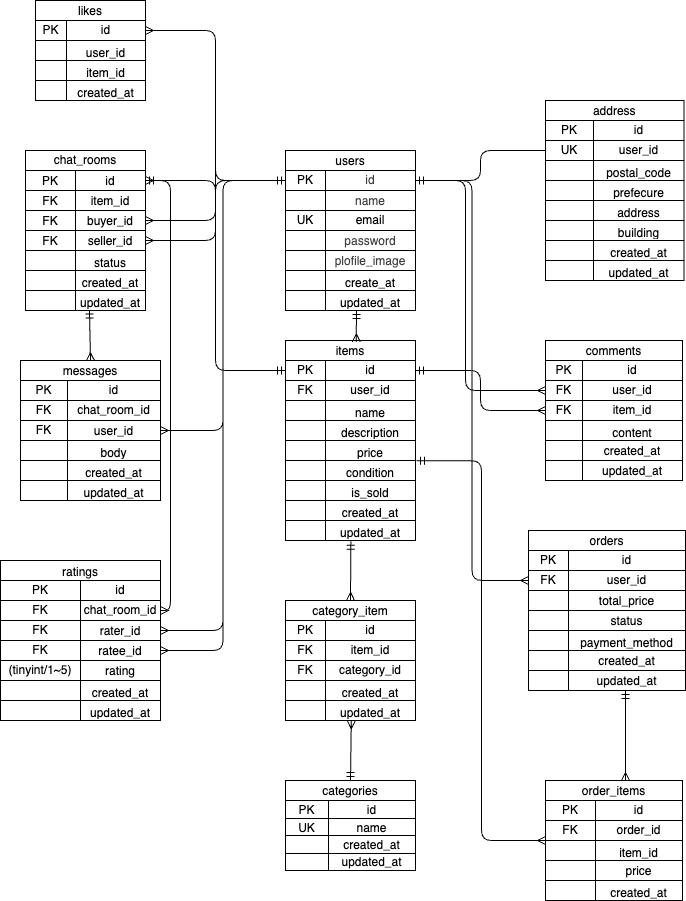

# フリマアプリ（coachtech 模擬案件）

Laravelを使用したフリマアプリです。
ユーザー登録、商品出品、購入、いいね、コメント、カテゴリー分類などの基本機能を実装しています。

# アプリケーション概要

本アプリは、ユーザーが商品を出品・購入できるフリマアプリです。
出品された商品に対して「いいね」や「コメント」が可能で、
商品は複数カテゴリに紐づけて管理できます。

また、購入希望者と出品者が商品ごとに取引チャットを行うことができ、
取引完了後には相互評価を行う仕組みを実装しています。

## 環境構築

Dockerビルド

git clone git@github.com:yuichihomma/coachtech-flea-app.git
cd coachtech-flea-app
docker-compose up -d --build

Laravel環境構築

docker-compose exec php bash
composer install
cp .env.example .env
php artisan key:generate
php artisan migrate
php artisan db:seed

## 使用技術

・PHP 8.x
・Laravel 8.x
・MySQL 8.x
・Nginx
・Docker / Docker Compose
・JavaScript
・CSS

## ER図

## 取引チャット機能

- 商品ごとに購入希望者と出品者の間でチャットルームを作成
- 同一商品に対し、同一購入希望者は1つのchat_roomのみ作成可能（unique制約）
- 取引ステータスは以下の流れで管理
  - trading（取引中）
  - rating（評価待ち）
  - completed（完了）
- 取引完了時にメール通知を送信
- 取引後は1〜5の整数で相互評価可能
- 同一チャット内での多重評価を防ぐため、(chat_room_id, rater_id) にunique制約を設定

## ダミーデータについて

本アプリでは、以下のダミーユーザーおよび商品データを作成しています。

### ユーザー一覧

#### ユーザーA（ID:2）
- 名前：テスト野郎
- メールアドレス：test@example.com
- パスワード:password
- 出品商品：
  - C001 腕時計
  - C002 HDD
  - C003 玉ねぎ3束
  - C004 革靴
  - C005 ノートPC

#### ユーザーB（ID:3）
- 名前：三似萌美
- メールアドレス：minimoni@yahoo.ne.jp
- パスワード:minimoni
- 出品商品：
  - C006 マイク
  - C007 ショルダーバッグ
  - C008 タンブラー
  - C009 コーヒーミル
  - C010 メイクセット

#### ユーザーC（ID:4）
- 名前：猫田敏三
- メールアドレス：nekoneko@yahoo.ne.jp
- パスワード:passpass
- 出品・購入履歴なし（未紐付けユーザー）

### 商品データ

商品データはC001〜C010までの10件を作成しています。

- 各商品は価格・説明・画像URL・コンディション情報を保持
- 一部商品は購入済み（is_sold = 1）
- 未購入商品は is_sold = 0

※ ダミーデータは `php artisan db:seed` により投入されます。
## 開発環境URL

・トップページ：http://localhost/
・会員登録：http://localhost/register
・ログイン:http://localhost/login
・phpMyAdmin:http://localhost:8081/
